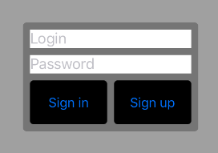

# ProgrammaticLayout.Net
Autolayout helper for Xamarin iOS applications

This code:
```csharp
var (ui, s) = StyleLibrary.Start();

var containerStyle = s.Background(UIColor.Red) + s.Width(200) + s.CornerRadius(4);
var fieldStyle = s.Background(UIColor.White);
var buttonStyle = s.Background(UIColor.Black) + s.Height(50) + s.CornerRadius(4);

ui.StackIn(View, s.Centered, s.Background(UIColor.LightGray)).With(
    ui.Stack(containerStyle, s.Margins(8)).With(
        ui.TextField("Login", fieldStyle),
        ui.TextField("Password", fieldStyle),
        ui.Stack(s.Horizontal, s.FillEqually, s.Spacing(8)).With(
            ui.SystemButton("Sign in", buttonStyle),
            ui.SystemButton("Sign up", buttonStyle)
        )
    )
);
```
Produces the following layout:



To see more, check this Xamarin workbook:
[ProgrammaticLayout.workbook](ProgrammaticLayout.workbook)


